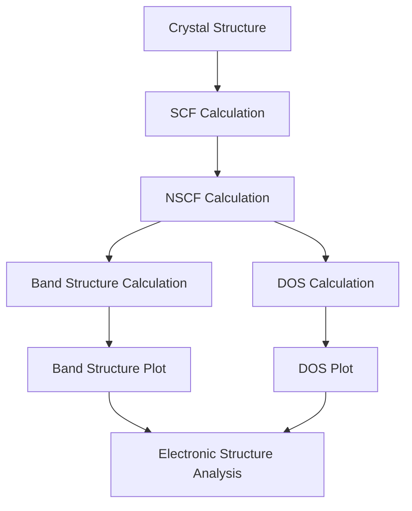

# Quantum ESPRESSO Band Structure and Density of States

## Overview
This project perform Density Functional Theory (DFT) calculations using Quantum ESPRESSO to compute Band Structures and Total Density of States (DOS). Electronic band structures and density of states (DOS) are calculated to understand determine whether a material is a metal, semiconductor, or insulator and conductive behavior of materials.

## Objectives
- Calculate electronic band structures
- Calculate total Density of States (DOS)
- Visualize and interpret the electronic properties of different materials

## Software and Tools
- Quantum ESPRESSO
- Linux
- Pseudopotentials
- xmgrace (Result plotting)

## Materials Studied
-
-
-

## Computational Workflow

## Results
- Combined Band Structure + DOS plot

  
